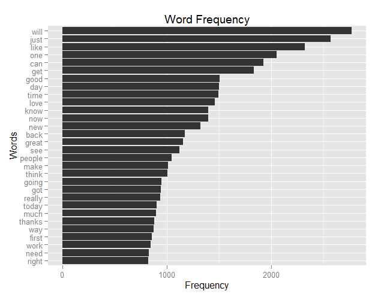
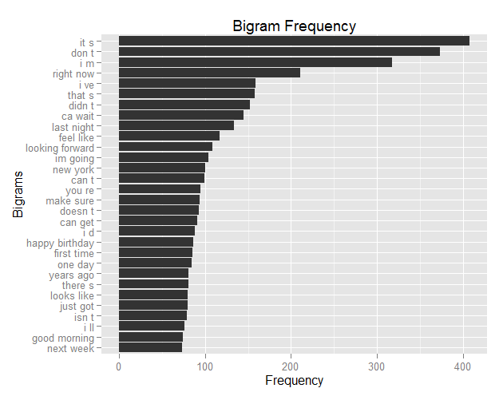
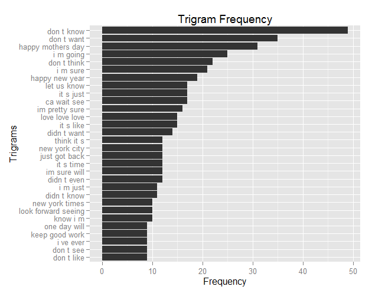

## Introduction
This document describes the data acquisition, cleansing and analysis I've done thus far for the Coursera Data Science Capstone Project as well as thoughts on the remaining tasks in the project. 
## Summary 
Below are the line counts for the three US files. 

* The US blogs file has 899,288 lines and approximately 4,799,000 words. 

* The US news file has 1,010,242 lines and approximately 886,300 words.

* The US Twitter file has 2,360,148 lines and approximately 4,424,800 words. 

Note: The analysis sampled 1% of the text files. Thus, the word counts above are estimates based on the sampled files.  

## Data Acquisition and Pre-Processing
To prepare environment, acquire the text and prepare the text files for exploratory analysis, I followed the following steps. 

1. Prepared the enviroment by loading the needed packages and enabling multicore processing.

2. Pulled in the data.

3. Created a function to pull a random 1% of the records from each of the three US files and write to a separate file.

4. Read in the three sample files and combine into one.

5. Cleaned up some contractions in the files.

6. Create a corpus and pre-process the text data.

7. Created a TermDocumentMatrix.

See Appendix A for more details on the code used for each step. 

## Exploratory Analysis
Upon completing the aforementioned pre-processing, I did a bit of clean up on the TDM and analyzed the text using the following steps.

1. Inspected the TDM.

2. Prepared the TDM for further analysis.

3. Plotted the top terms.

4. Create functions to tokenize n-grams using the NLP package. 

5. Transformed text data using tokenizer function and plotted top bigrams.

6. Transformed text data using tokenizer function and plotted top trigrams.

See Appendix B for more details on the code used for each step. 


This analysis yielded following frequencies of words, bigrams and trigrams (top 30 of each shown). 

Top 30 single terms:
 

Top 30 bigrams: 
 

Top 30 trigrams
 

There is still some clean up required for handling contractions. 

### Preliminary Findings 
Here are some observations that jumped out at me.

* The top 30 single terms are mainly common, one syllable terms with a few two syllable terms. This may be because the largest part of the corpus is from Twitter, which demands brief and simple language. 

* There are a lot of contractions in the bigram histogram.  

* New York is a popular place. The bigram and trigram top 30 lists both include some reference to New York City, which is the only proper noun included in any list besides....

* Happy Mothers Day! This phrase is the 3rd most popular trigram. Perhaps a lot of people are tweeting their mum on their special day. Interesting that "Happy Fathers Day" is not on the top 30 list. 

## Thoughts on the Prediction Model
My current thoughts on how to build the keystroke prediction algorithm required for the final deliverable are something like this:

1. As the user keys in characters, compare the string to the terms isolated from the corpus to see if the string exists in the corpus. This comparison would start at the beginning of the term. So if the user entered "it", this would match "itself", but not "partition".

2. Match the first keystroke to the entire list of n-grams. Show the top 7 n-grams by frequency. 

3. As the user continues entering keystrokes, recompare the string to the n-gram list and show top 7 n-grams by frequency. 

4. If the user enters a string that does not match the corpus, match to an open source word frequency list and show the top 7 most frequent words. 

## Thoughts on the Shiny App
Text search and retrieval has many applications. For this project, I plan to create a portal that enables users to type in keywords (with autocomplete recommendations as described above). The app will then use the entered keywords to query the corpus for documents that contain the keywords and create a word cloud for all words in those matching documents. This should help illustrate the sentiments associated with those keywords. 

## Appendix A: Data Acquisition and Pre-Processing Code

This section lists the code for the steps listed in the "Data Acquisition and Pre-Processing" section above. 

1. Prepared the enviroment by loading the needed packages and enabling multicore processing

```{r echo = TRUE, eval = FALSE, warning=FALSE, message=FALSE}
# first, let's set the working directory
setwd("C:/Users/fellt/Desktop/Data Science/Coursera Data Science Specialization/10 - Capstone")
#Prep environment for analysis
library(R.utils)
library(tm)
library(SnowballC)
library(NLP)
library(ggplot2)
library(parallel, quietly=T)
library(doParallel, quietly=T)
# turn on parallel processing to help improve performance
cluster <- makeCluster(detectCores() - 1)
registerDoParallel(cluster)
```
2. Pulled in the data.  

```{r echo = TRUE, eval = FALSE, warning=FALSE, message=FALSE}
#download.file("https://eventing.coursera.org/api/redirectStrict/VYmaDK_AgFQF7Lxt6LQVf1i3BcAkm_OZwAe5IU-m0_bP_AbIKyNnwWBGqIYPMxeXi1jFreu9mSce3kkDEcrB5Q.nKFU8mGvHIF_NqifbTJOCg.PdPVLe2Tri_4JhLMtsFKCsi03HwSetzTeY6v4Buz24fmTYdGQBiF9dRfOPZlQgL9ix2vfkOzQDxxTH_IlLlQ2oRmiUWjyU-pEG015VYID3tcSAZItG_4Wx_s4qiNbjMR7jp0An9Xj2YWWEni11DV8Fnz4RFr11cAMWAH3ycvlVVRAz6iYnfR_tN_xIcbmyJwJPVm7GMMr9mt_Wf2L68TCs2VUcsdzIRfKIflXqFF-c1oLltQsq618r22dChpkXvMB5CKsffMa9najDCB2t5yCLOcaRkvcYAOOt8M2Ui_eYcJoaL8OQIh0m78KThHe-9Yvb7RxDbL4oDZKDc4ZiaLctIJKPYpvxZVfrSZRcVzsVJcAkc1mmzjuh35LTDfjwsrudpCMlPfSmNNB5HwGYz4WWqVe4Td4Q3T9NXgM-SMb2U",
    destfile = 'capstone.zip')

# assign document paths to variables for later use
usBlogs <- 'final/en_US/en_US.blogs.txt'
usNews <- 'final/en_US/en_US.news.txt'
usTwit <- 'final/en_US/en_US.twitter.txt'
```
3. Created a function to pull a random 1% of the records from each of the three US files and write to a separate file. 

```{r echo = TRUE, eval = FALSE, warning=FALSE, message=FALSE}
# define function to read files and output smaller sample files
subsamfile <- function(infile,outfile,k,header=T) {
  ci <- file(infile,"r")
  co <- file(outfile,"w")
  if (header) {
    hdr <- readLines(ci,n=1)
    writeLines(hdr,co)
  }
  recnum = 0
  numout = 0
  while (TRUE) {
    inrec <- readLines(ci,n=1)
    if (length(inrec) == 0) { # end of file?
      close(co) 
      return(numout)
    }
    recnum <- recnum + 1
    if (recnum %% k == 0) {
      numout <- numout + 1
      writeLines(inrec,co)
    }
  }
}

# call function for each file, then close connection
subsamfile(usBlogs, 'final-sample/en_US/en_US.blogs.sample.txt', 100, F)
close(file(usBlogs))
subsamfile(usNews, 'final-sample/en_US/en_US.news.sample.txt', 100, F)
close(file(usNews))
subsamfile(usTwit, 'final-sample/en_US/en_US.twitter.sample.txt', 100, F)
close(file(usTwit))
```
4. Read in the three sample files and combine into one 

```{r echo = TRUE, eval = FALSE, warning=FALSE, message=FALSE}
usBlogsSmall <- read.csv2(file = 'final-sample/en_US/en_US.blogs.sample.txt', stringsAsFactors = FALSE, header = FALSE, quote = "")
usNewsSmall <- read.csv2(file = 'final-sample/en_US/en_US.news.sample.txt', stringsAsFactors = FALSE, header = FALSE, quote = "")
usTwitSmall <- read.csv2(file = 'final-sample/en_US/en_US.twitter.sample.txt', stringsAsFactors = FALSE, header = FALSE, quote = "")
usAllSmall <- rbind(usBlogsSmall, usNewsSmall, usTwitSmall)
```

5. Cleaned up some contractions in the files (because I could not get this to work using the normal tm pre-processing steps commands).

```{r echo = TRUE, eval = FALSE, warning=FALSE, message=FALSE}
# search and replace certain contractions: 'd , 're , n't , 'll , 've , it's 
head(usAllSmall[grepl("you d", usAllSmall[,1], ignore.case = TRUE) == TRUE,], n = 5)
usAllSmall[grepl("ya'll", usAllSmall[,1], ignore.case = TRUE) == TRUE,] <- gsub("ya'll", "yall ", usAllSmall[grepl("ya'll", usAllSmall[,1], ignore.case = TRUE) == TRUE,], ignore.case = TRUE)
usAllSmall[grepl("'ll ", usAllSmall[,1], ignore.case = TRUE) == TRUE,] <- gsub("'ll ", " will ", usAllSmall[grepl("'ll ", usAllSmall[,1], ignore.case = TRUE) == TRUE,], ignore.case = TRUE)
usAllSmall[grepl("'d ", usAllSmall[,1], ignore.case = TRUE) == TRUE,] <- gsub("'d ", " would ", usAllSmall[grepl("'d ", usAllSmall[,1], ignore.case = TRUE) == TRUE,], ignore.case = TRUE)
usAllSmall[grepl("'re ", usAllSmall[,1], ignore.case = TRUE) == TRUE,] <- gsub("'re ", " are ", usAllSmall[grepl("'re ", usAllSmall[,1], ignore.case = TRUE) == TRUE,], ignore.case = TRUE)
usAllSmall[grepl("'ve ", usAllSmall[,1], ignore.case = TRUE) == TRUE,] <- gsub("'ve ", " have ", usAllSmall[grepl("'ve ", usAllSmall[,1], ignore.case = TRUE) == TRUE,], ignore.case = TRUE)
usAllSmall[grepl("n't ", usAllSmall[,1], ignore.case = TRUE) == TRUE,] <- gsub("n't ", " not ", usAllSmall[grepl("n't ", usAllSmall[,1], ignore.case = TRUE) == TRUE,], ignore.case = TRUE)
usAllSmall[grepl("it's ", usAllSmall[,1], ignore.case = TRUE) == TRUE,] <- gsub("it's ", "it is ", usAllSmall[grepl("it's ", usAllSmall[,1], ignore.case = TRUE) == TRUE,], ignore.case = TRUE)
```

6. Create a corpus and pre-process the text data. 

```{r echo = TRUE, eval = FALSE, warning=FALSE, message=FALSE}
usVcorp <- VCorpus(DataframeSource(usAllSmall), list(reader = readPlain))
usVcorp <- tm_map(usVcorp, content_transformer(tolower))
usVcorp <- tm_map(usVcorp, removePunctuation)
usVcorp <- tm_map(usVcorp, removeWords, stopwords("english")) 
usVcorp <- tm_map(usVcorp, stripWhitespace)
usVcorp <- tm_map(usVcorp, removeNumbers)
#Filter for profanity
  bad <- read.csv("bad.csv", header = TRUE, strip.white = TRUE, stringsAsFactors = FALSE) # see http://www.cs.cmu.edu/~biglou/resources/bad-words.txt
  usVcorp <- tm_map(usVcorp, removeWords, bad$words)
usVcorp = tm_map(usVcorp, function(x) iconv(x, to="ASCII", sub=" ")) #remove odd characters
usVcorp <- tm_map(usVcorp, stemDocument)
usVcorp <- tm_map(usVcorp, PlainTextDocument)
```

7. Created a TermDocumentMatrix. 

```{r echo = TRUE, eval = FALSE, warning=FALSE, message=FALSE}
usVcorpTDM <- TermDocumentMatrix(usVcorp)
```


## Appendix B: Exploratory Analysis Code
Upon completing the aforementioned pre-processing, I did a bit of clean up on the TDM and analyzed the text using the following steps. 

1. Inspected the TDM. 
```{r echo = TRUE, eval = FALSE, warning=FALSE, message=FALSE}
# inspect Term Document Matrix 
inspect(usVcorpTDM)
dim(usVcorpTDM)
terms <- Terms(usVcorpTDM)
length(terms)
unique(Encoding(terms)) # ensure no UTF-8 or non-ASCII text
```

2. Prepared the TDM for further analysis. 
```{r echo = TRUE, eval = FALSE, warning=FALSE, message=FALSE}
#remove sparse terms
usVcorpTDM.common <- removeSparseTerms(usVcorpTDM, .999)
dim(usVcorpTDM.common)
freq <- rowSums(as.matrix((usVcorpTDM.common)))
ord <- order(freq)
freq[head(ord)]
freq[tail(ord, n = 30)]
wordFreq <- freq[tail(ord, n = 30)]
commonTerms <- Terms(usVcorpTDM.common)
length(commonTerms)
commonTerms #see terms
#transform to data for plotting
wordFreq <- as.data.frame(wordFreq)
wordFreq <- setDT(wordFreq, keep.rownames = TRUE)
wordFreq <- wordFreq[order(wordFreq, decreasing = TRUE),]
```
Removing the sparse terms was a necessary step to get the TDM to a manageable size. The .999 threshhold seemed high, but was the lowest I could go and still return a reasonable number. Converting usVcorp.common TDM to a numeric vector helped get it usable for plotting. 

3. Plotted the top terms. 
```{r echo = TRUE, eval = FALSE, warning=FALSE, message=FALSE}
# plot 30 most frequent words
g <- ggplot(wordFreq, 
            aes(reorder(rn, wordFreq), wordFreq))
g <- g + geom_bar(stat = "identity")
g <- g + coord_flip()
g <- g + ggtitle("Word Frequency")
g <- g + ylab("Frequency")
g <- g + xlab ("Words")
g
```
4. Create functions to tokenize n-grams using the NLP package (click http://tm.r-forge.r-project.org/faq.html#Bigrams for more details). 
```{r echo = TRUE, eval = FALSE, warning=FALSE, message=FALSE}
BigramTokenizer <-
  function(x)
    unlist(lapply(ngrams(words(x), 2), paste, collapse = " "), use.names = FALSE)

TrigramTokenizer <-
  function(x)
    unlist(lapply(ngrams(words(x), 3), paste, collapse = " "), use.names = FALSE)
```

5. Transformed text data using tokenizer function and plotted top bigrams. 

```{r echo = TRUE, eval = FALSE, warning=FALSE, message=FALSE}
usVcorpTDM.bigrams <- TermDocumentMatrix(usVcorp, control = list(tokenize = BigramTokenizer))
dim(usVcorpTDM.bigrams)
usVcorpTDM.bigrams.common <- removeSparseTerms(usVcorpTDM.bigrams, .9999)
dim(usVcorpTDM.bigrams.common)
Terms(usVcorpTDM.bigrams.common)
freq.bigram <- rowSums(as.matrix((usVcorpTDM.bigrams.common)))
ord <- order(freq.bigram)
freq.bigram[head(ord)]
freq.bigram[tail(ord, n = 30)]
bigramFreq <- freq.bigram[tail(ord, n = 30)]

#transform data for plotting
bigramFreq <- as.data.frame(bigramFreq)
bigramFreq <- setDT(bigramFreq, keep.rownames = TRUE)
bigramFreq <- bigramFreq[order(bigramFreq, decreasing = TRUE),]

# plot 20 most frequent bigrams
b <- ggplot(bigramFreq, 
            aes(reorder(rn, bigramFreq), bigramFreq))
b <- b + geom_bar(stat = "identity")
b <- b + coord_flip()
b <- b + ggtitle("Bigram Frequency")
b <- b + ylab("Frequency")
b <- b + xlab ("Bigrams")
b
```

6. Transformed text data using tokenizer function and plotted top trigrams. 
```{r echo = TRUE, eval = FALSE, warning=FALSE, message=FALSE}
usVcorpTDM.trigrams <- TermDocumentMatrix(usVcorp, control = list(tokenize = TrigramTokenizer))
dim(usVcorpTDM.trigrams)
usVcorpTDM.trigrams.common <- removeSparseTerms(usVcorpTDM.trigrams, .9999)
dim(usVcorpTDM.trigrams.common)
freq.trigram <- rowSums(as.matrix((usVcorpTDM.trigrams.common)))
ord <- order(freq.trigram)
freq.trigram[head(ord)]
freq.trigram[tail(ord, n = 30)]
trigramFreq <- freq.trigram[tail(ord, n = 30)]

#transform data for plotting
trigramFreq <- as.data.frame(trigramFreq)
trigramFreq <- setDT(trigramFreq, keep.rownames = TRUE)
trigramFreq <- trigramFreq[order(trigramFreq, decreasing = TRUE),]
#trigramFreq <- transform(trigramFreq, rn = reorder(rn, order(trigramFreq, decreasing = TRUE)))

# plot 30 most frequent trigrams
t <- ggplot(trigramFreq, 
    aes(reorder(rn, trigramFreq), trigramFreq))
t <- t + geom_bar(stat = "identity")
t <- t + coord_flip()
t <- t + ggtitle("Trigram Frequency")
t <- t + ylab("Frequency")
t <- t + xlab ("Trigrams")
#t <- t + theme(axis.text.x = element_text(angle = 45))
t
```
